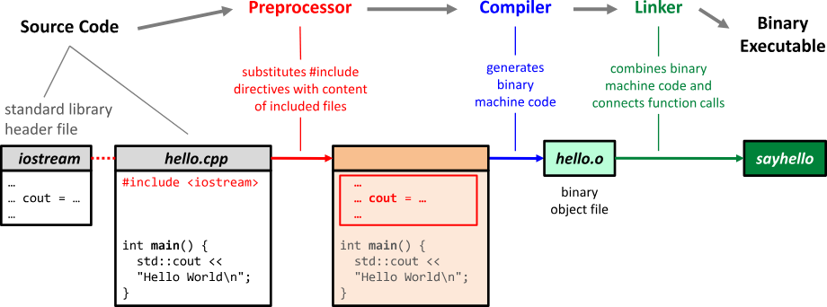

# 🚲 Gcc 编译的背后

## 前言

在以往的学习过程中, 我们知道 C 语言的执行的四大流程 : 预处理、编译、汇编、链接,&#x20;

在这里我偷个懒使用 C++ 来作为表示 (两个语言的处理流程大致都一样)

<figure><figcaption><p>来源: https://hackingcpp.com/cpp/hello_world.html</p></figcaption></figure>

## Preprocessor (预处理)

预处理是 C 程序从源代码变成可执行程序的第一步, 在这一步中编译器主要做的操作是:

1. 预处理指令处理：预处理器会扫描源代码中以 `#` 开头的预处理指令，并根据指令进行相应的处理。常见的预处理指令包括 `#include`、`#define`、`#ifdef`、`#ifndef`、`#if`、`#else`、`#endif` 等。预处理指令可以用于包含头文件、宏定义、条件编译等操作。
2. 头文件包含：通过 `#include` 指令，预处理器可以将其他头文件的内容插入当前源文件中。这样可以在源代码中使用其他文件中定义的函数、变量和类型声明，提供了代码的模块化和重用性。
3. 宏展开：预处理器会处理 `#define` 指令定义的宏，并将宏在代码中的引用展开为宏定义的内容。这样可以在源代码中使用宏来进行代码替换，提高代码的可读性和维护性。
4. 条件编译：通过 `#ifdef`、`#ifndef`、`#if` 等条件编译指令，预处理器可以根据条件判断选择性地编译部分代码。这样可以根据不同的编译选项或环境条件，在不同的情况下编译不同的代码。
5. 注释删除：预处理器会删除源代码中的注释，这样注释的内容在编译过程中将不被考虑。

> 主要还是归属于两步 : 预处理指令的处理以及注释删除

在这里我们可以通过下面的命令来查看预处理的输出 (有点长), 从输出中我们可以看到其主要做的操作还是实现程序所需资源的准备

```sh
$ gcc -E hello.c
```

